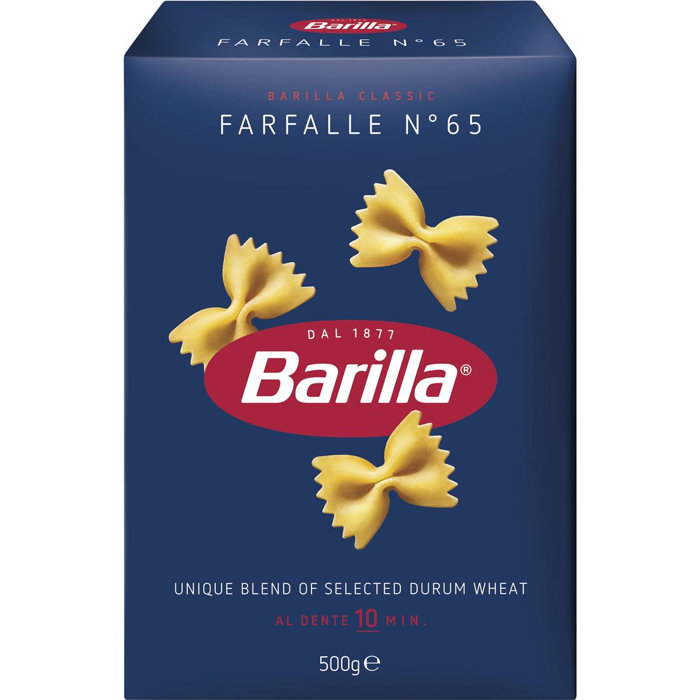

# AllThePasta 🍝

Scrapping and visualizing all the different pasta Barilla has to propose.

In the files above you will find all the cursed code used to progressively grab all the pasta types based on the country codes proposed on the website.

I first grab the links referring to the pasta before then scanning and taking individual pasta.

The rest is done on google docs by using IMAGE() to visually inspect the images and mention the number.